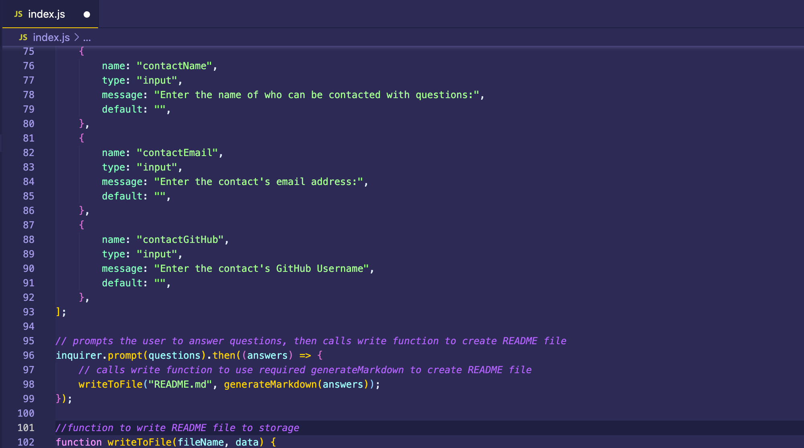

# hw9-README-Generator

## Table of Contents:

-   [Description](./README-hw9.md#description)
-   [Installation](./README-hw9.md#installation)
-   [Usage](./README-hw9.md#usage)
-   [Contributing](./README-hw9.md#contributing)
-   [Tests](./README-hw9.md#tests)
-   [Screenshot](./README-hw9.md#screenshot)
-   [Links to Application](./README-hw9.md#links-to-application)
-   [Questions](./README-hw9.md#questions)

## Description

This is a command-line application that accepts input from the user and then generates a professional looking README from that input. The README that is generated includes title, table of contents, description, installation, usage, license, contribution, testing, screenshot, links, and questions sections. As the user gives inputs, these sections are filled out with the inputs given. When a license is chosen, a badge representing that license is added next to the title, the license seciton is added to the table of contents, and a license section is added to the markdown giving some information about the license chosen. The listings in the table of contents are links that will jump a viewer to the relevant section.

## Installation

If you wish to use this application, you will need to access my GitHub account and copy the code.

## Usage

To use this application, obtain the code from my GitHub account, and run "ndoe index.js" from the command line terminal.

## Contributing

If you wish to contribute to my content, please contact me at asunshine99@gmail.com.

## Tests

To test this application, run "node index.js", fill out all of the inputs, and then check the generated README to see if all of the input information showed up as expected.

## Screenshot

## Links to Application

-   Here is the demo video on Google Drive: [https://drive.google.com/file/d/129D7NfPRfFvrmcgBh1HNZsL_cVAHM9tz/view?usp=sharing](https://drive.google.com/file/d/129D7NfPRfFvrmcgBh1HNZsL_cVAHM9tz/view?usp=sharing)
-   Here is the repo: [https://github.com/RedComet6/hw9-readme-generator](https://github.com/RedComet6/hw9-readme-generator)
-   Here is the pages: [https://redcomet6.github.io/hw9-readme-generator/](https://redcomet6.github.io/hw9-readme-generator/)

## Questions

If you have any questions, you may contact:

#### Aidan Chamberlain

Email: asunshine99@gmail.com  
Github Profile: [https://www.github.com/RedComet6](https://www.github.com/RedComet6)
