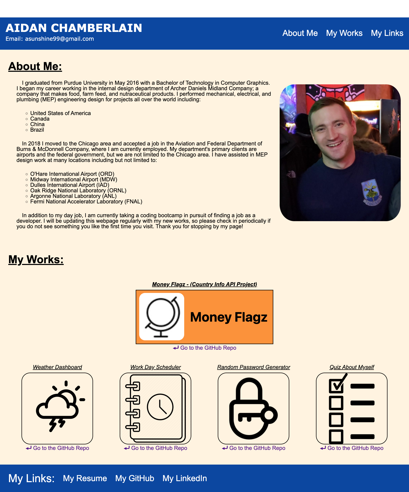

# check screenshot

## Table of Contents:
* [Description](./README.md#description)
* [Installation](./README.md#installation)
* [Usage](./README.md#usage)
* [License](./README.md#license)
* [Contributing](./README.md#contributing)
* [Tests](./README.md#tests)
* [Screenshot](./README.md#screenshot)
* [Links to Application](./README.md#links-to-application)
* [Questions](./README.md#questions)
    
## Description
check desc

## Installation
check install

## Usage
check inst

## License
    
## Contributing
check const

## Tests
check test

## Screenshot
    

    
## Links to Application
    
-   Here is the repo: [RedComet6/check screenshot](https://www.)
-   Here is the pages: [RedComet6 check screenshot Pages](https://www.)
    
## Questions
If you have any questions, you may contact:

#### Aidan Chamberlain
Email: asunshine99@gmail.com  
Github Profile: [https://www.github.com/RedComet6](https://www.github.com/RedComet6)